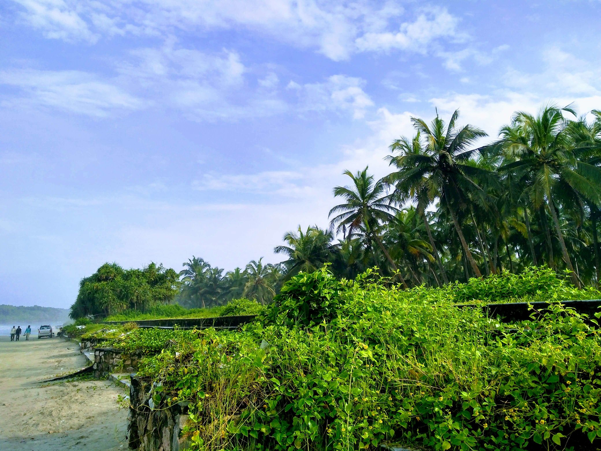
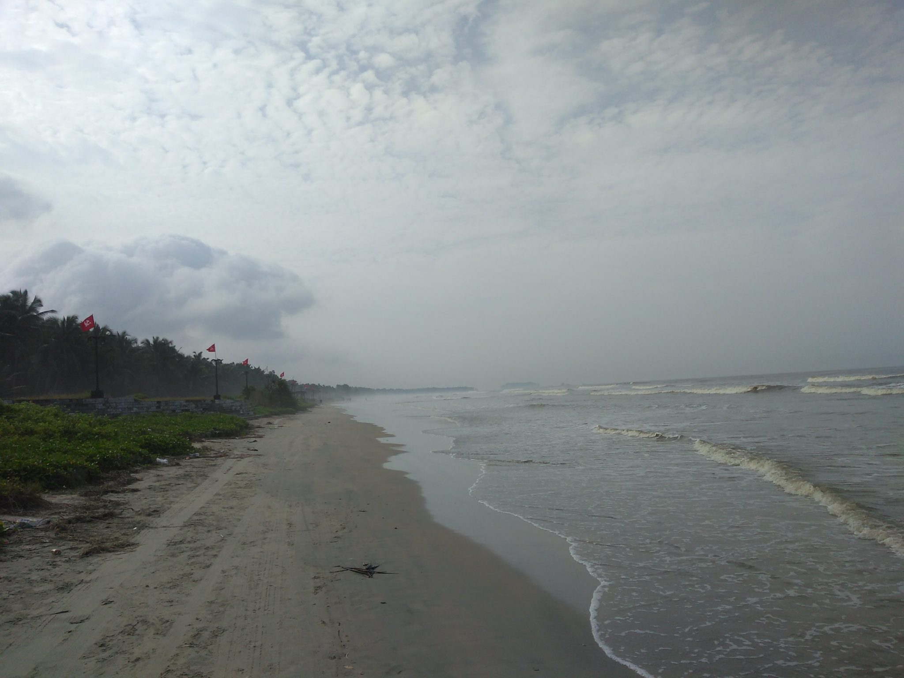
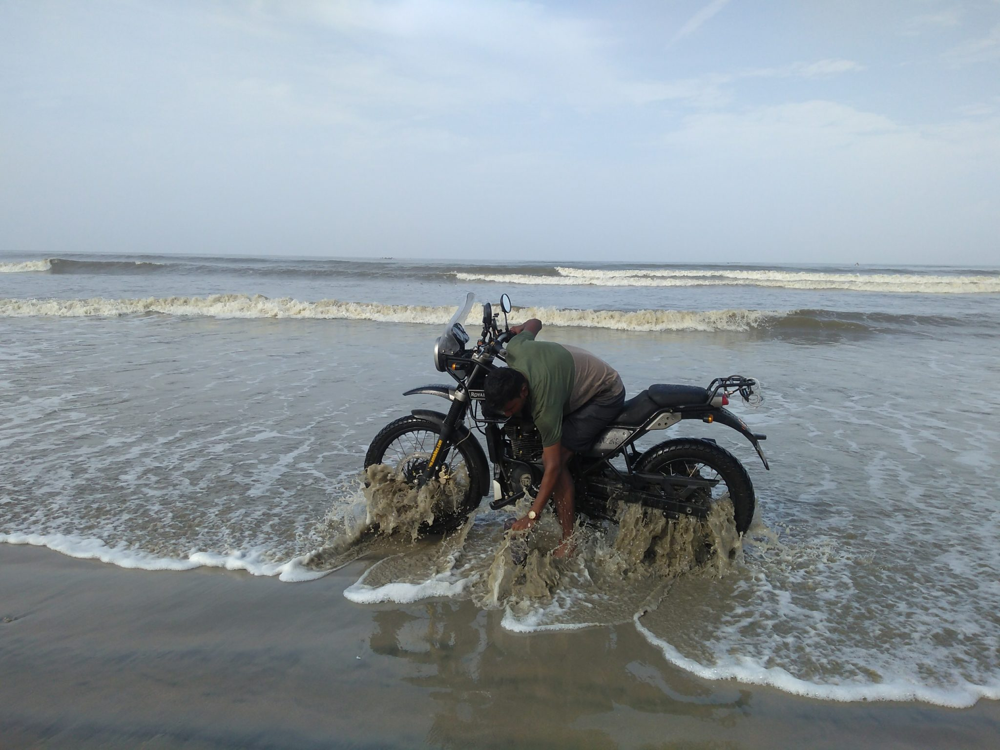
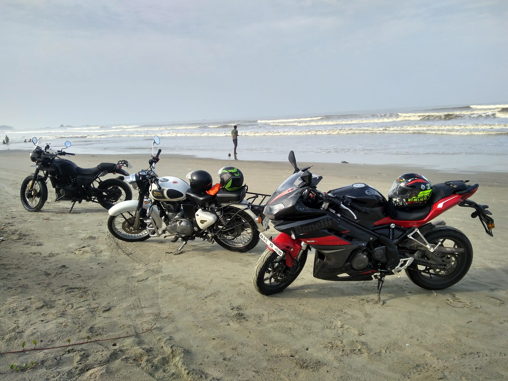
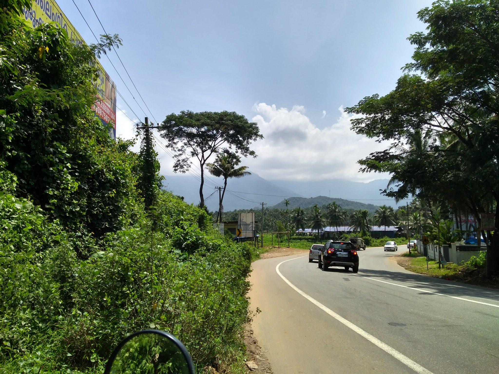
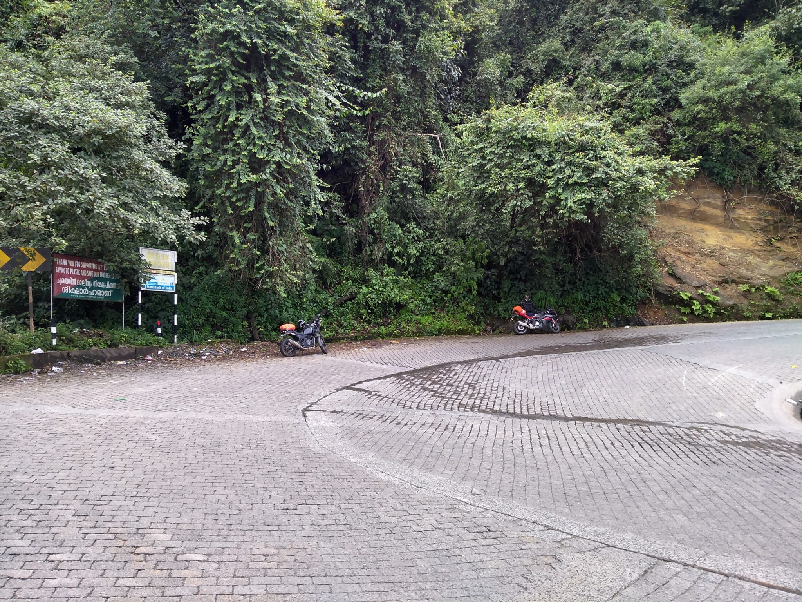
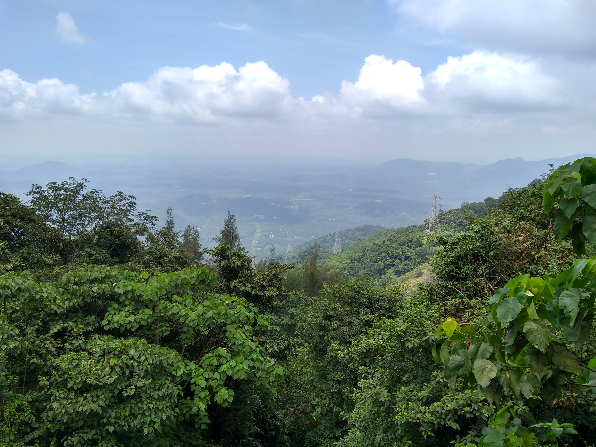

[Read Part 1 ](https://milestogobeforeisleep.in/2017/10/my-first-ever-kerala-trip/)

Part 2 of 2
On Day2, we had gone to this drive in beach. Here are few of the photos. Its feels much more beautiful there.

> Day 3:

It was Onam and we thought we could visit a temple in the morning. It was around 8 AM and we were all posing with our bike at home for photoshoot. Wearing white Lungi, the default traditional look now mandatory in many temples across South India (atleast that I know of).

We visited the temple in Anonymous's car and he gave us a tour of Calicut. It was a great morning because this was the first time someone showing me their city, recalling memories of past.

And breakfast was ready for us as soon as we came back. We satisfied our stomachs with enough delicious food and started to pack up. It was time to leave for Wayanad! Had heard so much about Thamarassery roads. This place is on the way to Wayanad. It was a wonderful ride all the way through. Few curves that gave really good feel to ride a bike.
By the time we reached Wayanad it was 2 PM. We had lunch and decided to hit few places around. It was slightly drizzing. We were like "rain is not going to stop us" and went ahead. We got wet, drenched completely and it was such an experience. Riding through Wayanad forests in rain, it was majestic.

We could not visit Chembra Peak as we were late and locals told us not to go there now as it will be closed. We thought definitely next time & settled with taking some rest in the room already booked a before.

> Day 4:

We could not visit / see any places in Wayanad on Day 3. We were eager to visit a waterfall and we had to return to Bangalore on the same day. An iterinary was made with 2 or 3 places which we could see on the way to Bangalore (somewhat).

There was this waterfall named "Soochipari Waterfalls" - the ride to this place is just wonderful. Somewhat bad and small roads, through rocks & forests, through tea plantations - had so much fun. And once we reached the falls, everything was worth it. It happened so that it rained heavily the previous day, the water flow had increased. Even then, there was some safe place at the base of the fall where you could just dive in and just have fun.
We hit a dam on the way - this too was good as we saw so much water - a very big lake, controlled by this one big dam. This was enough for us for the day. A 300KM+ ride back to Bangalore was still pending, after 10 AM.

We started riding back to Bengalore after 10 AM and came through the Bandipur forest, Mysore, Mandya and then Home.
It was a different experience as this was my first time in Kerala, accompanied by 2 of the localites, it was worth it.

Here are some of the pictures from the ride to Wayanad from Calicut. A wonderful ride through forests and soaking in rain.

