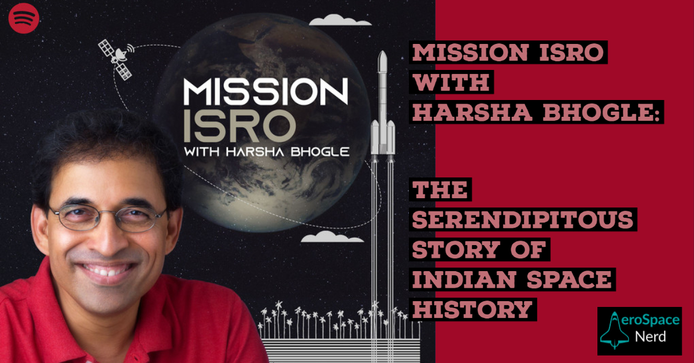

Harsha Bhogle, fondly known as The Voice of Cricket, his love for the game, his knowledge and his enchanting cricket commentary is all too well known in the cricketing world.

Mission ISRO is a podcast narrated by Harsha, spread over 12 episodes describing how ISRO came to be, how it is what it is today.

You'll get chills listening to it, how every step of the way someone put their hand up to take India forward when it came to Space Research and science. Learn about Homi Baba, Vikram Sarabhai, APJ Abdul Kalam (Missile Man), Udipi Rao (Satellite Man) and people who actually started at ISRO in the beginning and worked with these elite personalities to shine light on Indian Space Research at international level.

Some of the interesting thoughts are questions like "Does a poor country like India need a Space Research organisation" and many more. Vikram Sarabhai is known as a visionary for his role in invigorating this zeal in other scientists to not back down and work hard - today we can launch our own satellites, from our very own launch vehicle, on a launchpad on our land.

All episodes are free to listen on Spotify. Visit the official Mission ISRO website to look at some breathtaking photographs from those early days of ISRO.

## Links
[Mission ISRO Official site](https://allthingssmall.in/shows/podcasts/mission-isro/)

[Spotify Podcast](https://open.spotify.com/show/2JXFCMLGVhTBtdz1WYxd4H)
