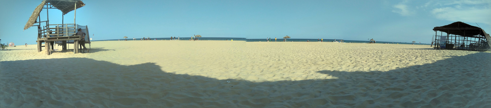

Oh Pondicherry is such a beautiful place. Don't know where to start!

The place is so diverse that everyone will thoroughly enjoy. There are few things that you should definitely not miss out.

 	
  1. **The Paradise Beach** & Serenity Beach got the perfect names. You should take a boat ride to Paradise Beach and spend time to get into water, not just clicking photos.

You can also collect seashells & other things that you can find in abundance. It was a beautiful experience to just stand there with my feet in the water, with so many sea shells flowing through.

  2. **Serenity beach** is good but you may find it somewhat "not clean". Lot of litter and it seems people really don't care for cleanliness. Auroville Beach is pretty much the same. Good waves there though.

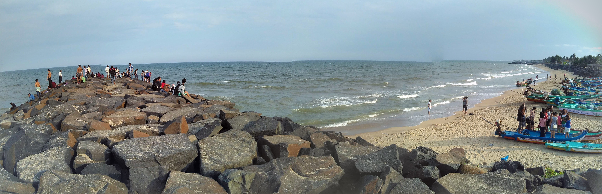

  3. **Pondicherry Museum** is also a great place to visit. Some of the great stuff I saw were these: Coins & Currency as old as 1630's from different countries, Guns as old as 1870's, Gutenberg mode Printing machine, Canon Balls from 18th Century, Stone tools from neolithic Period (about 10,200 BC, in some parts of the Middle East, and later in other parts of the world and ending between 4500 and 2000 BC - wiki), fragments of wine amphoras from Greek Island of Kos and Burial Urn from 1st Century BC, Bricks from 200 BC - 200 AD, stunning & intricately carved sculptures of Lord Ganesha & Nataraj from 12th century, beheaded statues of Buddha from 1oth Century, and so on!
There is also a library beside the museum.

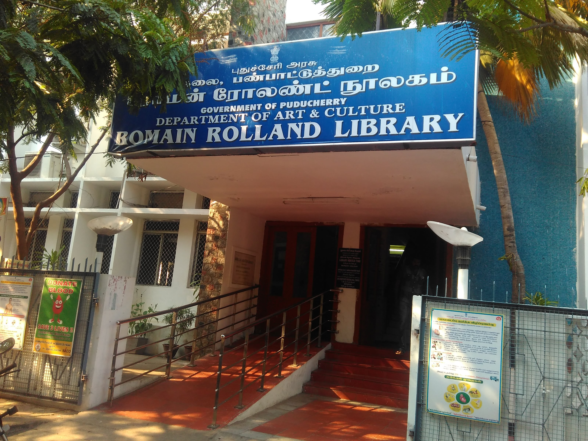

  4. Don't miss out to visit the **Botanical Garden**, even if you are not a fan of plants. There are fossils as old as **"20 million years" **, trees from so many different regions, an amazing **aquarium** with collection of fish & other species from so many places around the world.
And above all, it offers peace! You can just sit there on the lush green grass and read a book, listening to the sounds of chirping birds.

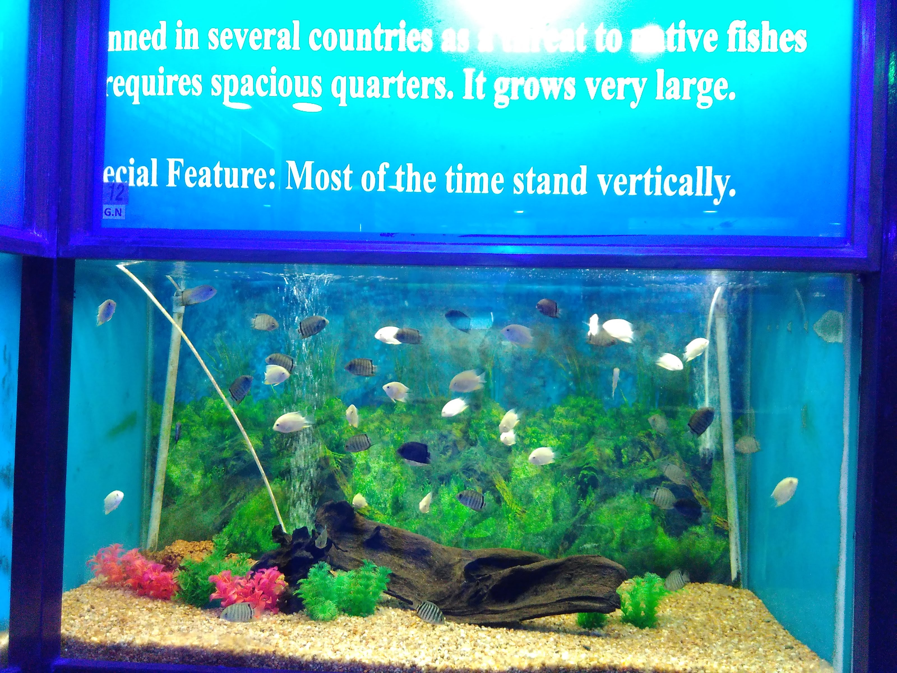
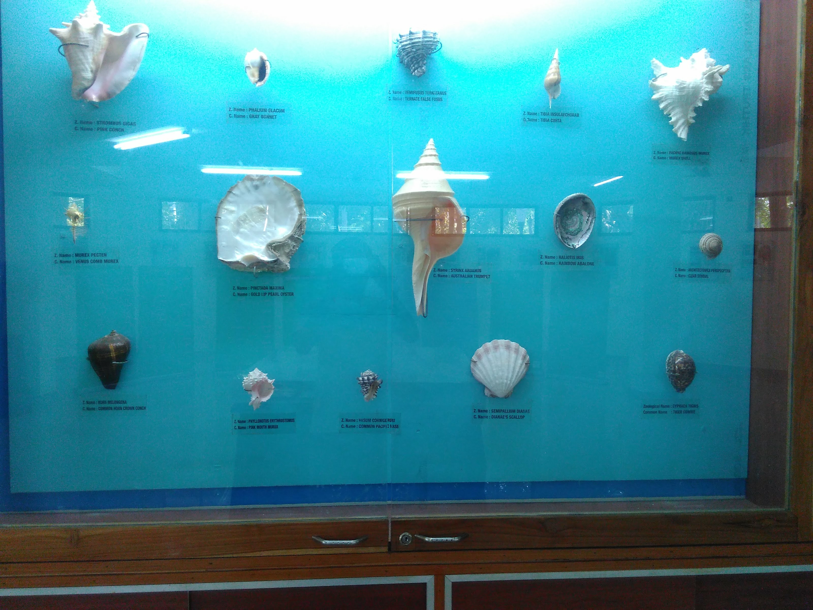
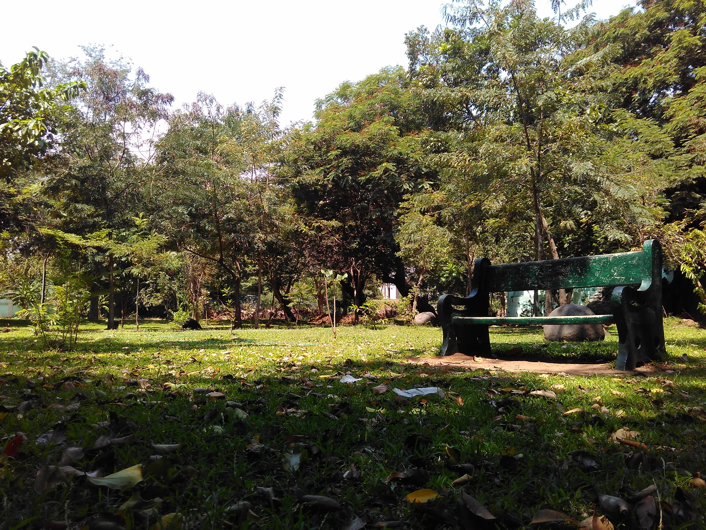

  5. **Rock beach & Aurobindo Ashram** are definitely on the list. Rock Beach is more like Marine Drive in Mumbai, its not a beach. But there is enough sand and rocks to get the feel and just sit there listening to the sound of waves.

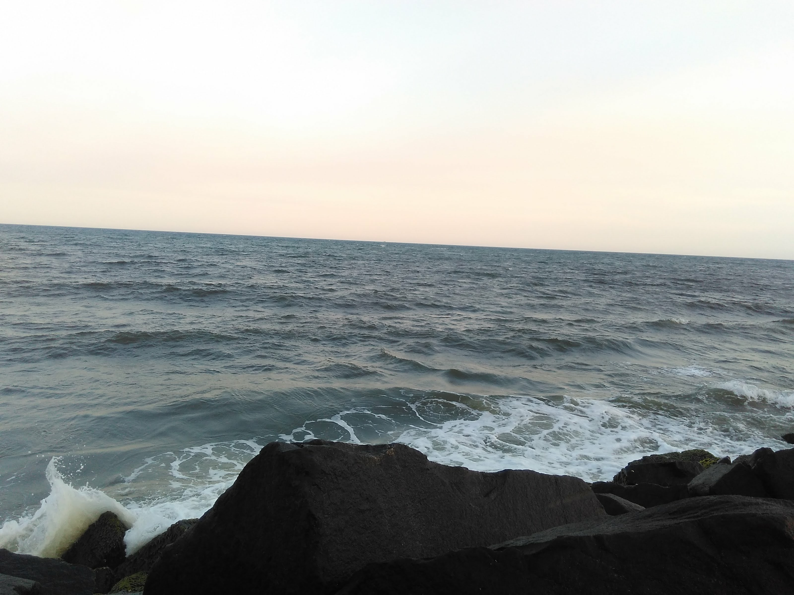
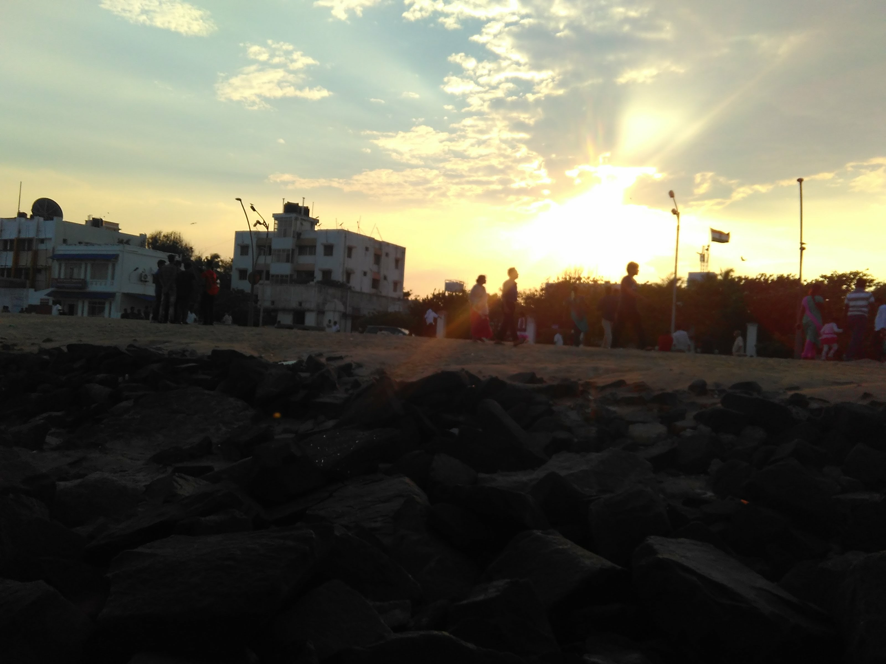
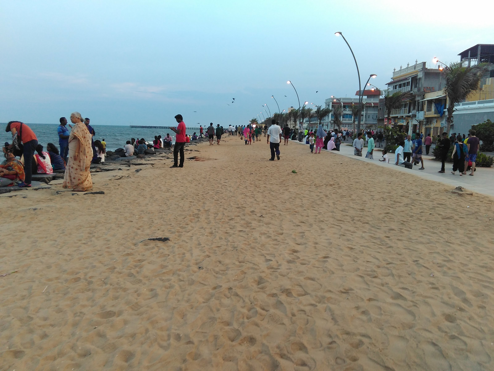

I sat there in the evening and slowly saw the moon rise. It was just so exhilarating. Gradually the stars started to appear and I thought because of bright lights you cannot see stars. But I was wrong! The star were visible and I just sat there admiring the bright orange moon and starry sky. It was absolutely a gorgeous sight and nothing else mattered at that point of time.

  6. And it was time to visit **Auroville**. That is such a peaceful place. One should visit this place at least once. Don't forget to visit the Video Room to see the documentary of the place and what it means. It shows how MatriMandir was built, what is the purpose of it, etc. **Without knowing that, there is no point in visiting Auroville.**

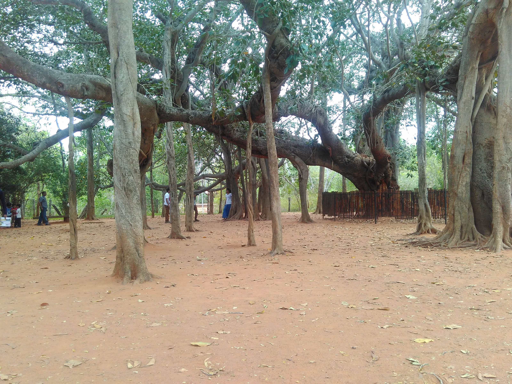
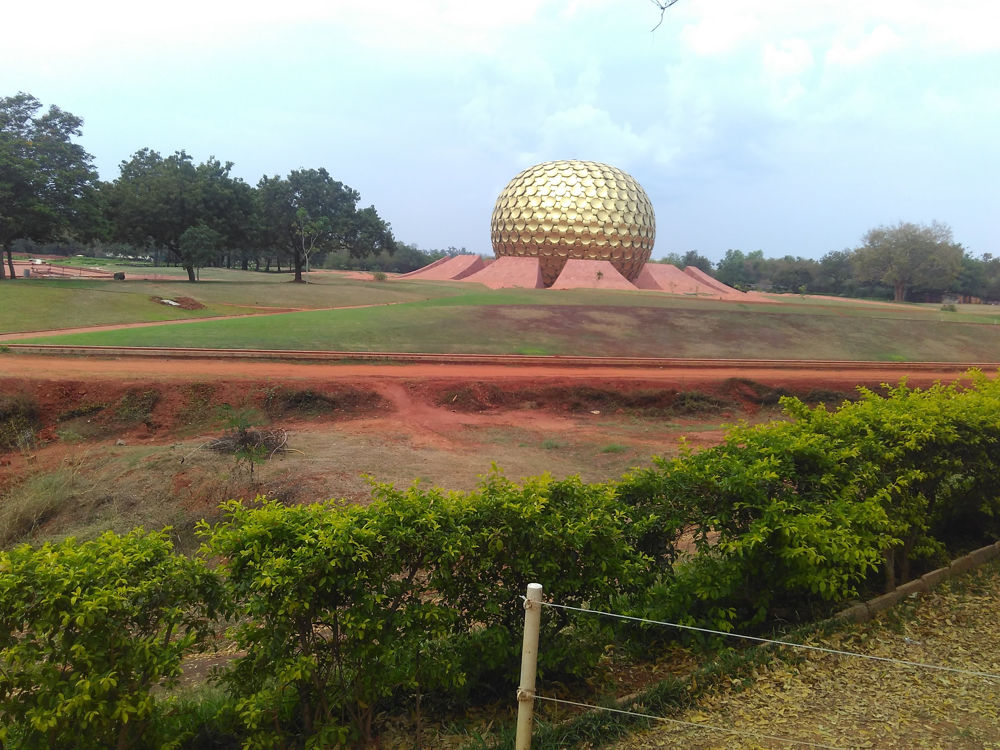

I think I visited Pondicherry during a festival time and it was such a sight to watch all processions going on in every single street. More in the Heritage Town. Just reminded me of the childhood days in the village where there was some culture left. Now, I am not sure, people have become busy, gone off to cities and who has time nowadays.

If you are planning to visit Pondicherry (go alone if your friends are just making lame excuses for not coming / postponing), here are few tips:

 	
  * Don't ask auto guys for a room: They will take you to one, but will take commission from the Hotel and you end up paying more. Usually, AC rooms will cost around 800 to 1000 Rupees per day in Heritage Town.

 	
  * Stay in Heritage Town / Just 1 / 2 Km from Rock Beach. You can cover many places to the north & South of Pondi. And in the evening, you can just take a stroll through the streets and Rock Beach.

 	
  * Visit Auroville & MatriMandir. There are few botiques inside when you visit MatriMandir. Visit them even if you don't want to buy anything. They have some amazing stuff!

 	
  * There are lot of famous restaurants & cafes. Few are Le cafe at the Rock Beach, Sea Gulls Restaurant near Rock Beach, Cafe des Arts and there are so many!

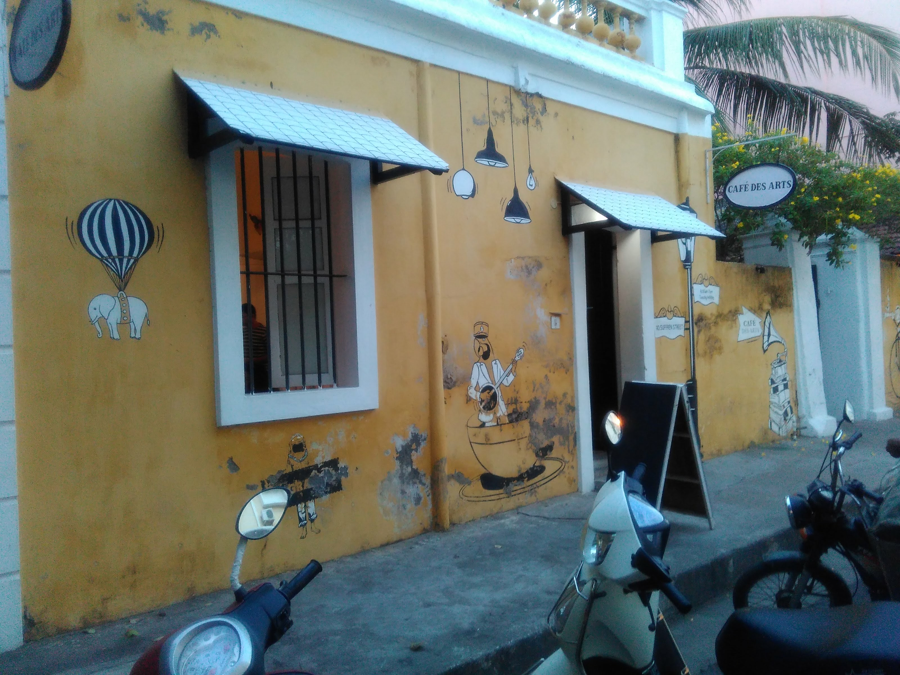
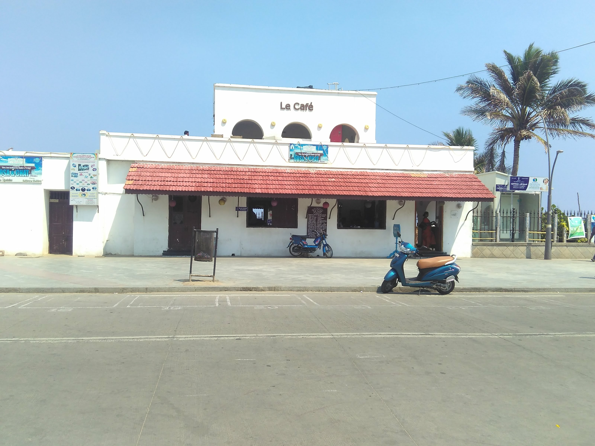
