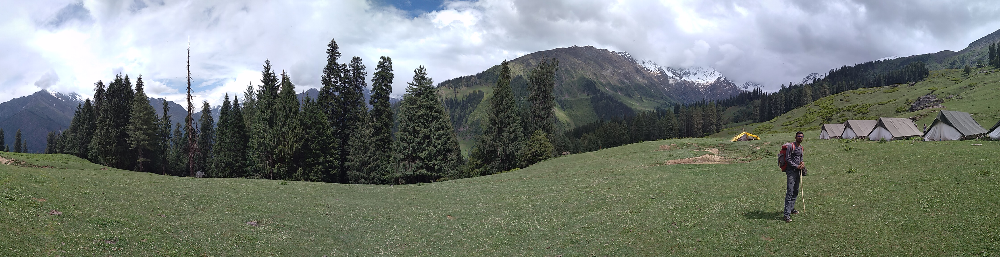

After so much planning and eager wait, I finally went for solo Backpacking across Manali, Kasol, Dharamshala, Bir Billing, Rishikesh. I will try to give some tips / advise if you are travelling to these places - on what to see, where to stay, what to do.

This list is very customised as everyones' likes and dislikes differ widely. I will try to list basic common points like stay, travel and few places you should not miss, a rough idea so that you would not lose your mind over small things at the last moments.
I would start with Manali, then Kasol, then Dharamshala, Bir Billing and finally Rishikesh. Sharing my experiences in these places might probably help more. So stay tuned for the updates.

**Day 01** : Manali  
**Day 02-11**: Kasol - YHAI Sar Pass Trek along with 60 other strangers.  
**Day 12**: Dharamshala - Visit to Mcleodganj  
**Day 13**: Bir Billing - Paragliding  
**Day 14-15**: Rishikesh - Bungy Jump, River Rafting from ShivPuri, Flying Fox   

My next post will be the YHAI Sar Pass Trek experience. I had a great time and so much to say.
