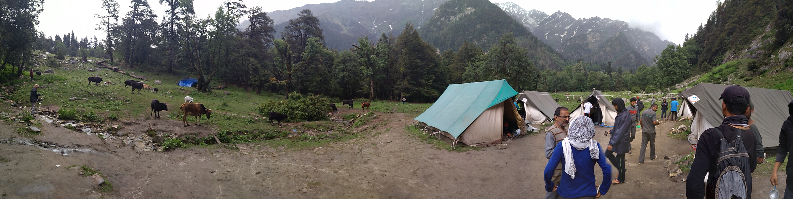

Part 1 of 2. Its a long post. With pictures and amazing experiences with a group of 60 strangers.

I have always wanted to go to snowy places where all you can see is snow. Wondered how it felt to feel those snow flakes falling on you at those chilling temperatures.
Maybe this wish had led me to YHAI Jhalori Pass Mountain Biking 2 years ago. But to my bad luck, there was not much of snow.  Few friends I made there told amazing things about the YHAI Sar Pass Trek. So I decided to go for it and I did. This year.
And it was an experience of a lifetime. When people say that I think, that's bullshit. There are a thousand things you might think of. However small or big your imagination is, this was the best trek of my life, till now.
Some advice if you are registering for Sar Pass YHAI trek (bookings start around September I guess, keep checking www.yhaindia.org national programs):

 	
  1. **Choosing Date of Trek:** The trek is for 11 days. Choosing your starting date is important for few reasons. You get to see lot of snow, slide on snow, do star-gazing and lot more. My starting date was off and we reached higher camps during full moon. The whole sky was lit with starts at 9PM, but at 12 Am, we could hardly see stars because of moon light.
Bookings usually start from May-June, so book your slot around 5th or 10 batch, that would come around May 1st or 2nd week. You can go till 3rd or 4th week if there is a full moon.
Trust me, this is very important!

 	
  2. **Documents to submit:** You would need a medical certificiate in prescribed format. You can get one from a local doctor, but dont take your chances on the doctor's availability in Kasol. You can get one signed by any registered doctor for some charge.

 	
  3. **Things to bring: **This is compulsory. **Go for quality stuff as you would realise later that the money invested is worth it**. All things mentioned here are very useful. You will not have to worry once you start going towards higher camps if you are prepared. Make this as a must-have checklist.

Rain Coat (not poncho or plastic cover, buy proper rain jacket & pants - Quechua rain tops & lowers are available at decent cost and amazing quality) This allows you to move easily. We had bought 100Rs plastic covers which we realised later was a big mistake.
Trekking Shoes - Quechua has trekking shoes in range of 3000Rs-7000Rs. Forclaz 500 (6000Rs - waterproof upto 8hrs and all condition withstanding shoes) is the best one as reviewed by lot of my group mates. You can buy other shoes as well, but these are the best.

Pants & Shirts - Buy those gym kind of clothes which can dry quickly and weigh less. Every gram you carry to the top just feels more heavier. There was a time 1 of my tent-mate decided to just throw things to make bag lighter!
Warm Clothes (also called Thermals) - Required for higher camps where temperature easily goes below 5C or even less. Just keep a pair. Careful of the weight!
Goggles (black googles with UV protection coating), Cap, Muffler, Waterproof Hand Gloves, Torch, Good Trekking Bag with Rain Cover (YHAI gives you a bag, you can use that. You can buy Quechua Rain cover for 30-40L bag size) - Just to ensure you are protected from very cold winds, rain and snowfall.

I not going to add any bullet points or numbering because although it might look organized, it does not give the feel of a story telling. I want to tell my story of Sar Pass YHAI Trek experience.

It all started with **Day 01** reporting at the base camp. You enter the camp and see everyone busy going here and there. There are guys coming back after completing the trek, people drying their clothes on tents. The whole view just gives you the feeling that something new, something different from your regular life is going to happen over the next 10 days.

**Day 02** started with official Acclimatisation - to adjust to the weather there, we all (group of 60) went on a small trek and stayed for around 2 hrs near riverside - sharing stories of each others' travel, just relaxing.
In the evening, everyday, a new batch arrives at the base camp after completing the trek. We have a function to celebrate their success & later welcome the new group. The new group will give performances - dance, singing, guitar, flute, shayari, comedy what not.
I always wanted to try StandUp Comedy. I know i am horrible at it, but wanted to try anyway and I did. I guess it was OK or probably a complete disaster. Just need lot of practice and prep!
There were few good performances and enjoyed good 3 days at the base camp meeting new people. Met a scuba diving instructor from AP, working in Andaman. It was such a cool experience to listen from him about life in Andaman & scuba diving.

Here are some scenes at the base camp and **Day 02**:

**Day 03** was supposed to be Rock Climbing and Rappelling. We went for rock climbing at a near by place in the woods. The rock was around 20 ft height. Since we were a group of 60, it took more than 3hrs for all of us to climb. We came back to the base camp to have lunch and it suddenly started to rain heavily from nowhere.
This is how it is there it seems. Weather can play with you. As they say there "You can only climb if the mountains give you permission". That saying felt 100% true while were were on the verge of reaching the top.
Also today was one of our fellow tent-mate Animesh's birthday. We celebrated with a small cake from a German bakery inside our tent. It was a complete surprise as he did not see this coming. We all had just met 2 days ago and no one would have seen that. The whole day, each one from our tent got to know that today is his birthday and we kept silent. It was a great last day at the base camp.

**Day 04 **was the day. There is this tradition (I guess) at the base camp that whenever a new batch is leaving for the trek, everyone from next 2 groups (at a time, 3 batches stay at base camp - 3 x 60 = 180 trekkers) form 2 lines on both sides clapping and sending off the current group. Wishing everyone all the best & best of luck.
Here is a video of that (taken by group-mate kamlesh bhai):

<video width="720" height="480" controls>
  <source src="https://milestogobeforeisleep.in/wp-content/uploads/2017/07/send_off.mp4" type="video/mp4" />
  Your browser does not support the video tag.
</video>

It was a moderate trek for 1st day and we had to reach our camp near a village called Graham. I don't know how much effort YHAI has put into to select these camp sites, but trust me, you are going to love each and every camp. With scenic beauty, wonderful mountain ranges, lush greenery you will find everything at every camp.

We used to say at each camp - this is the best camp site. Such was the beauty up on those hills.
We reached **Grahan camp** at 7700 ft after going through the village. There was a school (till 8th) and kids were playing volley ball there. With such intense concentration!
At every camp, after you reach, you get a welcome drink! And tea. And then Snacks. And then dinner. At 6 PM.
**Yes, dinner at 6PM** because there is no electricity at any of the camps except the base camp. You have dinner at 6pm, evening bournvita at 8pm and sleep at 10pm. Before that, in the evening, we took some amazing photos and spent some time just walking in the lush green agricultural fields.
Scenes at Grahan Camp:

**Day 05** started early at 5.30am as usual. Early tea, freshen up (no bath, even if you want to), breakfast, return sleeping bags &  blankets, clean your tents and pack-up for the next camp Padri at 9300 ft. This day was particularly painful. I remember it so vividly because heavy rain after mid-way had made our ascent arduous.
There were people skidding and falling everywhere, even with those good grip trekking shoes. I can't remember how many times i had come so close to falling. And I can't remember how many times i had crawled on all 4 limbs to be sure to reach the top safely, without even worrying there are thorn plants that can cause high irritation. Luckily, I climbed that slippery hill without any incidents or contact with thorns.
Later it stopped to rain and we gradually moved up to reach this breath-taking place that was our camp at **Padri**. There was this vast green grounds with small rocks sprinkled in between. After some distance there were these trees that marked the start of dense forest, which were off limits because there was high chance of an encounter with wild animals!

The other side there was this small stream of water falling from around 40 meters or so. Would have been majestic if there was more water. And topping all this, there were these snow mountains. They felt much closer to you than the other camps. The whole place at that time was just enchanting.
We all thoroughly enjoyed, took photos in different poses, saw 2 bulls fight, horses grazing so close to your tents. As it was complete lights-out bcoz of no electricity, all our tent guys started to play Mafia game. Trust me this game gets good once you start playing. It might appear not so interesting or boring even, but it truly is a very good game.

After playing for over 3 hrs, we all were tired and wanted to pee. Now here is the problem. Toilets were some 50 meters away hidden in mid-dense forest. And there are so many cattle, horses and probably wild animals - because of which, we were advised to go to toilet - along with a friend just to stand guard.
We all chucked that idea and went outside our tent, we would have walked for 10 meters, then we all started to pee, under the stars, with moon showing mercy on us and throwing some light. All 12 of us, peeing in open, laughing out loud because we just couldn't control the laughter. At 11 am when everyone was supposed to be asleep. This day was very fun after some difficult trek. It was not very cold here, in fact it was warm.
Here are some photos and video of bull fight (courtesy of Ketan sir!):

<video width="720" height="480" controls>
  <source src="https://milestogobeforeisleep.in/wp-content/uploads/2017/06/e1bffa92-cee3-43e4-9525-537624b82f7e.mp4" type="video/mp4" />
  Your browser does not support the video tag.
</video>

Few pics:

Hang on for Part 2. Its more exciting and more adventurous.

