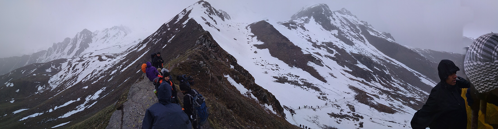

Part 2 of 2 ( [Part 1 ](http://confused.pe.hu/2017/07/living-life-sar-pass-yhai-11-day-trek-in-himachal-near-kasol-part-1/))
This post became a bit longer than i had anticipated. Believe me, i tried to keep it short. 
There are some photos here and there.

**Day 06 **started with a great view in the morning with hot tea. All of us got ready and ready to leave for our next camp **Mingthach at 11200 feet**. The trek this day was not very hard. It was fun actually since you had been on the mountains for few days now.
We reached our lunch point after a moderate trek. This was one of the best lunch points! There was this plain ground with less than knee height grass and some kind of flower plants. And the view of distant mountains. Nothing in between your eyes and those mountains. It was a moment to just savour and feast for your eyes.

We stopped at lunch point.
There was a couple who couldn't carry their backpacks so they hired a local porter. Infact there were 2 porters (lets call them locals). Daughter and mother. I reached few minutes early to this amazing place and decided to capture how others felt when they saw this place. I recorded few videos of how they felt and it was pretty cool to know how different people feel about these things.
Those 2 locals had arrived just after us, but they just sat devouring the sight of those distant mountains. I wanted to know how they felt about tourists/travellers going there and seeing them struggle at times when trekking on those mountains. And also how they decided to live this far up in the mountains.
The daughter was shy and she didn't want to be interviewed, but her mother was cool with it. I have the video but not posting it because i don't have permission for that.

> Gist of the talk:
> "Me: What do you think of all these people who come here, climbing these mountains with you? They seem to get exhausted pretty soon but you seem like you don't know what that is.
> 
> She: We are used to it. It is what normal is for us. But for others, it is tough, because they don't do it on regular basis. (like itna vo log chalte nahi hai, then both daughter and mother started to giggle.)
> 
> Me: Its true. In City life rarely people walk that much, just office and home. To and fro. Not much physical work. What do you do if someone falls ill or needs medical attention? (They stay at Grahan village, our first camp, at height of 7,700 ft and Kasol is at 6,500 ft) It must take probably an hour for you to reach Kasol from Grahan.
> 
> She: No, it takes around 3 hrs because if someone is ill, they need to carry them. On homemade stretchers.
> I didn't know what to say. I couldn't think of anything. I just said its very hardwork and said thank you.
> "

There were lot of guys and girls in our group who were very tired on our first trek to Grahan Village. There were more than few steep ascents and it felt like its never going to end. Imagine carrying a patient in that terrain. What if it rains? What if there are heavy winds? What if there is a wild animal that is ready waiting for you?
That is something i can never imagine.

We started to have lunch, hot maggi (it is a must-have at these heights and it tastes better here.) and hot tea. Suddenly it started to become dark and drizzle. All of us moved into this small tent which was local vendor's shop. All 60 of us were able to just stand there. And suddenly it started to rain heavily and then hailstorm! Don't know how it happened so suddenly but we were more than excited, evident from our top of our voices shouting. Probably most of us were thinking ahead that if it rains and snows it would increase the chance of us meeting snow up there on the top.
Most of us were kind of dejected at base camp when few guys from the returning batch after successful trek told us that there was not much snow and slide was not there.

As much crazy as it sounds, all that heavy rains, hailstorm everything was ok with us, as long as it adds up to us seeing snow on top.
The snow-capped mountains which we were clicking photos of from everyone since we started appeared much closer than ever. We all finally reached the camp. This camp site was amazing too. Surrounded by mountains all around. Greenery & snow for as far as you can see.
I also had some time to fill my travel journal to log previous days' events. Had evening tea, snacks, then dinner and saw fewer stars than expected. Not a very eventful day. Sitting there in setting sun, with those warm rays on you, sipping tea, horses grazing right beside you as if you are not there, those golden colored mountains when sun was almost gone in the evening, it was one of a sight.
I remember it vividly as if it happened few days ago although it has been more than a month.

Few scenes at Mingthach:

**Day 07 **was our ascent to **Nagaro Camp at 12500 ft**.
We all dispersed after warning by our local guide at MingThach camp of "things to be taken care of at Nagaro camp". The ascent was so steep that we all were tired just after 30 min. We took frequent rests and the route was dangerous than any we had encountered on the trek till now.
There were rarely high rise trees when we were climbing. It was just steep another steep hill with grass kind of flora. We had lunch in between and proceeded to Nagaro.
**There were 2 local boys carrying cooking items till Nagaro from Grahan Camp.**
Here i met 2 local kids, aged 10 maybe, carrying boxes on their back, securely tied so that it won't come off unless you want to. They were going from Grahan to Nagaro. (there is a shortcut from Grahan, our 1st camp to Nagaro, our 4th camp skipping Padri and Mingthach)

They were carrying groceries to the camp, where we got our food. Since we were going to have food because of hard work of 2 kids, I wanted to have a chat with them.
I enquired about how their childhood is like in those mounatains, what sports they play, their schooling, what they do in free time. 

Here are few top things I can remember:

> q1. How do you like it here? Is climbing difficult for you?
> a. We like it. No, its not that difficult. We climb regularly but not all the till the top.
> 
> q2: Do you go out to travel? Like have you visited Manali? (around 4hr journey from Kasol)
> a: No, we've never been there. We've seen nearby places (some places that are probably famous among locals)
> 
> q3: What do you study?
> a: I study in 6th class (maybe 7th.). We go to school in Grahan only. Till 8th.
> 
> q4: After 8th what do you do?
> a: If anyone wants to study after 8th, they go to Manikaran. They stay there in rented houses. On a rotation basis, family members of 1 kid stay with all other kids from their village, taking care of them.
> 
> q5: You watch movies? In a theater maybe?
> a: We watch whatever comes on TV. No, we've never been to a theater.
> 

**All this struggle to study beyond class 8th.**

As soon as we reached the camp, all the pain endured by everyone was i guess relieved. Such was the view from the top. I know you must be thinking i am probably exaggerating. Not at all. See some of the pics of this camp! Everyone was quick to take out phones to call their loved ones to let them know that they are alive, well & having hell of a time. Because we did not have mobile network for the last 5 days or so.
This camp was special. This was the highest camp, just before Sar Pass. And there is no water here for toilet use. You have no option other than tissue papers. Honestly you can't complain at this height. **Even the drinking water is supplied after melting fresh snow here.**
Had fresh tea served for us and sitting there, sipping hot tea with peanuts, just looking at those distant mountains was epic. All you had to do was nothing. Just sit, lay, relax. No hurry, no confusions, no tensions. Everything that is plaguing our daily lives.

We were warned sternly by our camp leader at Nagaro that weather plays hide and seek better here than any other camps. Do not challenge the mountains. Have early dinner at 6pm and do not wander off here. Or else you would end up somewhere below - invisible maybe.
All of us had our early dinner and went into tents as it started to rain now. To describe exactly the scene was ominous at its best. All mountains were now hidden behind these dark clouds all around. We all sneaked into our tents and just prayed it would snow - so that we get to see more snow on top.
It all changed in matter of minutes. That long range of mountains with snow toppings now started to fade away gradually. After 6.30pm or so it all went out - not a tree visible apart from the this small hill we were on. Everything was engulfed in those ominously dark clouds, occasional hailstorm, hint of snowfall.
It was a unique experience. 

And finally it happened. The snow fall. Many of us, who were forced to stay at tent ends had been trying to catch a glimpse of the outside more frequently. As soon as the snow started to come down other tent occupants got excited and started shouting and coming out wearing full gear. I too was excited and amazed, just put on the jacket, gloves & socks. Preparing as if we were going to fight something! We were all shouting like kids who had just seen rain and snow.
It was magical. The heavy winds causing us to speak like you were miles apart, playing with our raincovers, those little snow flakes on your face gives you that chill feeling. My 1st snowfall experience - at 12,000+ft, alongside 7 other tents, with 60 other strangers who i had trekked with since last 6 or 7 days it was worthy of 11-day trek.

Scenes at Nagarro Camp:

**Day 08 **was the moment of final glory. We were supposed to get up extra early ( 2 am ), have breakfast at 3 am, left the camp around 4 am. The reason was the fresh snow from yesterday would melt in the day time.
We all did wake up early that day. But a bit late. We were ready to go after having breakfast & packing our lunch by 4 am i think. It was somewhat dark and many of us were already putting the torches they had brought for the same purpose to use.
The whole mountain in front of us was as white as it could get maybe. As if someone had painstakingly painted it white just to play with you. 

You could see that at 4am because of early light reaching those high mountains. We all had no idea what was ahead. We just knew there would be some snow because of previous day's snowfall in the evening.
The climb began with thin layers of ice beneath us. With greenery visible as soon you scratch the surface to reveal whats beneath it. It was not very hard as we were able to grip our shoes by placing heavy footsteps. After few minutes, the climb became suddenly more daunting. With steep climbs, ice layers getting more thick thus shoe grip was decreasing and no path. You just had to place your shoe, make a foothold, then use the other leg, do the same and climb.
After some dangerously steep ascent on those icy-rocky patch we reach a place that was plain for few meters. 

There was so much snow that we could slide from that small height. We were so busy making snowballs as soon as we reached there. Our local guide gleefully started shouting that we should start moving as our main attraction was very near and it was much more than what we were seeing here.
I believed him. A lot of us did. Because they know these mountains like you know the road from your home to a nearby shop or a temple or a hospital. They know when weather changes, what to expect to some extent and how to be prepared. After all, these mountains were their home growing up.

We did reach the top finally. As I reached the top, we had to climb a big rock from the side, so were not able to see at first what was ahead of us. Those far sighted mountains looked more beautiful than ever. There was this mountain with so much snow on top of it was so close to us that we never lost the sight of it. Slowly it started to reveal. And man was it worth all this? Hell yeah, in an instant, without hesitation. Most beautiful sight i had ever seen. With snow for as long as you can see. It felt like you could just skii from the top to where i was standing and have the best time of your life.

Here are some pics of this place:

We took photos in different poses including but not limited to: harry potter on broom, upside down, top less body builder (yeah why not, just in future), in the air pics, push-ups pics, completely lying on your backs.
All of us soaked in all the beauty as the local guide Thakur's started to tell us about all the different peaks and ranges. It was very informative but sadly could not remember all those names. We then started to move towards what was actually called Sar Pass. It not just one spot. Its a pass. Its a path connecting two mountains.

As we started to slowy descend from this absolute peach of a place to chill we found a high mountain with good slope and snow on it. This was the best place to slide, for about 50+ meters or so! We started climbing that slope after having hot tea at the lone tent / other human other than us trekkers. After a while, it was so steep that even crawling on all fours would not help to reach more height.

Then it started. One by one few of us started to slide. It was such a relishing experience even to watch. I waited long for someone to bring a plastic sheet on which we could slide, but i was eager to go. I decided my pants can withstand a slide on snow, all i need to bear is the cold. Why not, i took the chance before weather started to play again.

We then moved on to descend and reached **Biskeri camp at** **11000 feet**. It was also a great location. We played cricket there (made from used clothes maybe) and it was a fun experience, coz if you hit a six (of less than the regular distance), you are never going to find it again.

Next day we descended to **BhandakTaj camp at 8080 feet**. Many of the group members played kabaddi (and had some minor injuries too.) We were all waiting for the evening as there was arrangement for actual camp fire. With wood and fire.
There was singing, rapping, singing in mix languages, sharing of one's experiences and it went on till 10 pm. The stars were the best part of this camp. You lie down on the cold and damp grass, not caring your clothes are going to get wet. You see the whole sky lit with stars, no matter where you see. I had never seen so many stars in my life. Not even when i had been to Jhalori pass cycling expedition.
Tent mate Animesh had set up his DSLR camera on tripod with remote to capture an image of the sky every 30 seconds for 3 hrs or so. Following is the result:

<figure>
	
	<figcaption>Star Trail at 12,000 ft</figcaption>
</figure>

Search on google for Startrail photography and you will find similar, amazing photos.
After 11pm, it felt like someone drew over the sky and painted it pitch black, with a faint white layer of paint. Since it was full-moon time, stars disapear as the moon shines.

We all left for Kasol the next day. Went to Manikaran Hot water bath. Thats for another post.
Would encourage you to book the trek and go. Bookings start probably around September. But keep checking YHAIndia.org, these tickets get sold quickly.
End of YHAI Sar Pass trekking diaries now!
Bye Bye!
