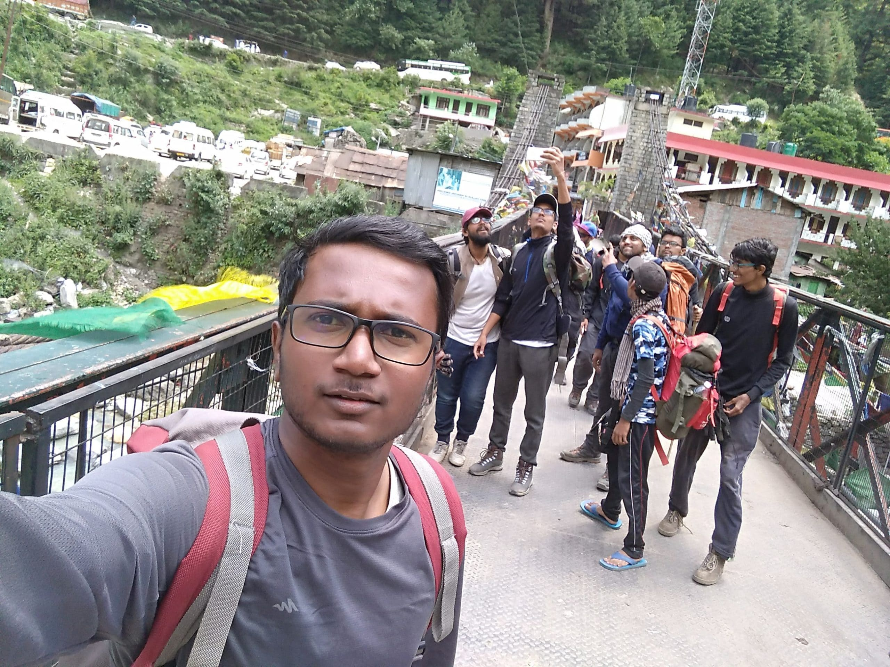
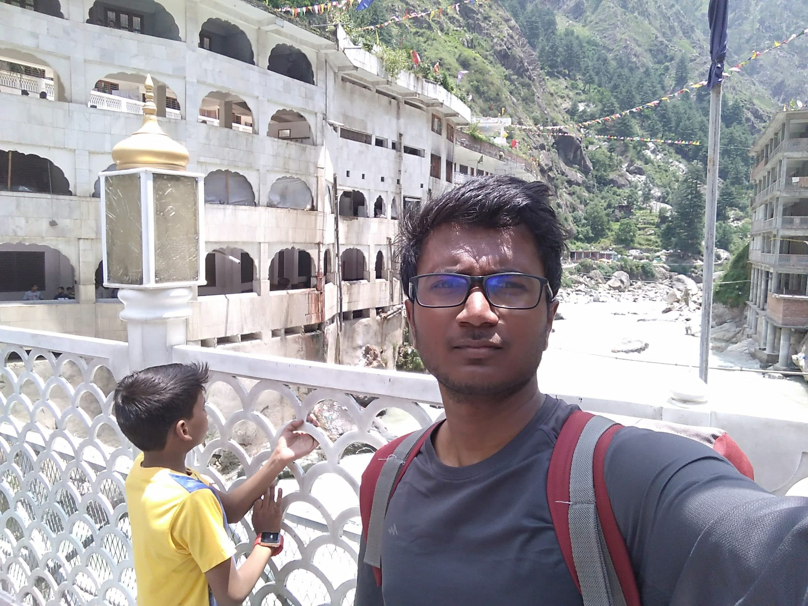
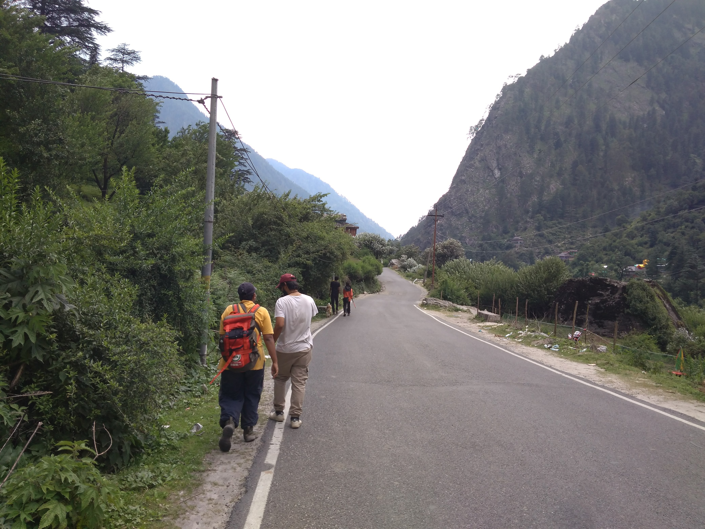

Manikaran is a place near Kasol, in Himachal Pradesh. It is famous for its natural hot water spring and Gurudwara and few other temples.

How to Reach: You need to reach Manali or better Bhuntar, from there board a bus to Manikaran. Route is Manali -> Bhuntar -> Kasol -> Manikaran.

The hot water spring is somewhere below the Gurudwara itself and lot more hot water streams are seen around. Inside gurudwara there is a public bath, kind of swimming pool (for men I know, not sure about females - might have private baths).
Here very hot water, coming from the natural spring is mixed with cold water so that people can take bath. Let me tell you, the water will be very hot even after mixing with cold water. 

The main purpose it seems is to relieve you of all your body pains.
It is said that the hot water contains sulfur which is good for the body (not sure, verify this yourself). As soon as you dip into this indoor pool you start to feel the heat. Many people hesitate to get into water because it too hot.
Do it. Go into the pool and take a bath. Keep moving and stay in the water. You can come out and go inside in intervals since the water is too hot. Just take care not to stay too long or submerge your head for long time.
Have fun for 10 or 15 mins and then come out. You will start to feel slightly dizzy (majority cases) - this is normal because the water is very hot.

I've been there twice. I took bath twice. It was really rejuvenating. The 2nd time, i was coming back from a 11-day trek to Sar Pass near Kasol. After the bath, all the pain in my body dissapeared. I was ready for more trekking.
We all (i was with tent 14 mates, my fellow travellers in SP-31 group of Sar Pass YHAI Trek) left Manikaran and decided to walk towards Kasol (4Km) because the buses didnt stop when we all desperately were standing on the road to reach Kasol.
Walking 4Kms was effortless after a 11-day trek because all the pain was gone.
This is real. There are numerous hot baths everywhere in Himachal. They are like life-savers for locals in the winter. Hot baths act as pain & pressure relievers. Try once and you will love it.

Here are few pictures:

